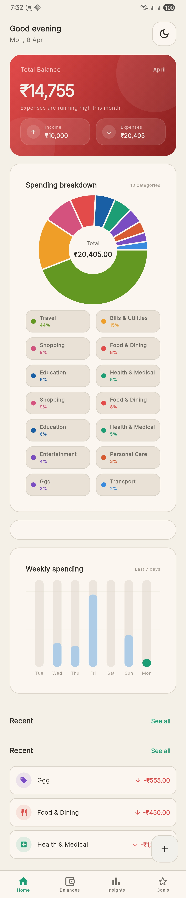
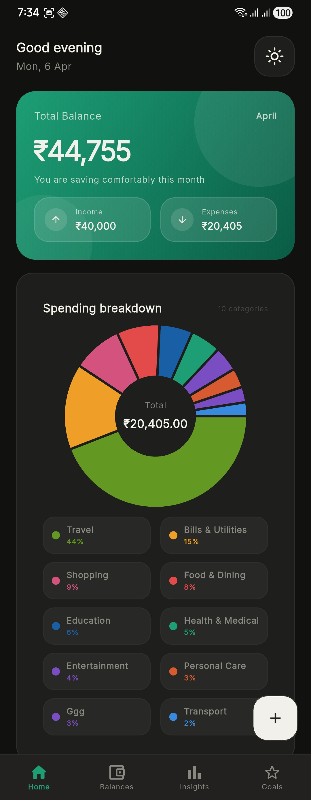
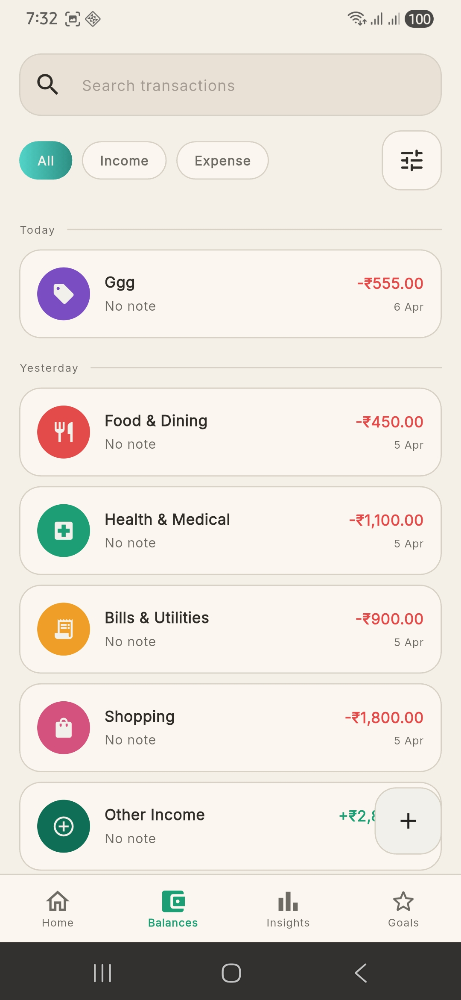
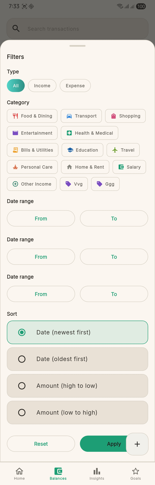
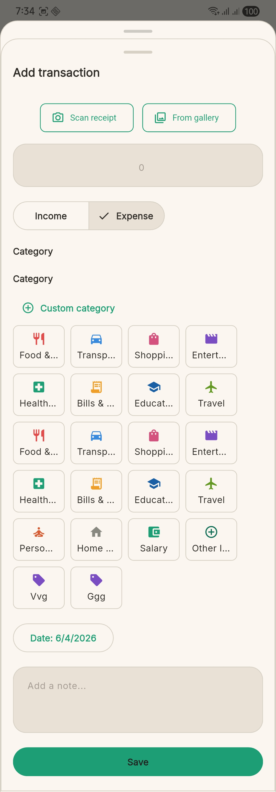
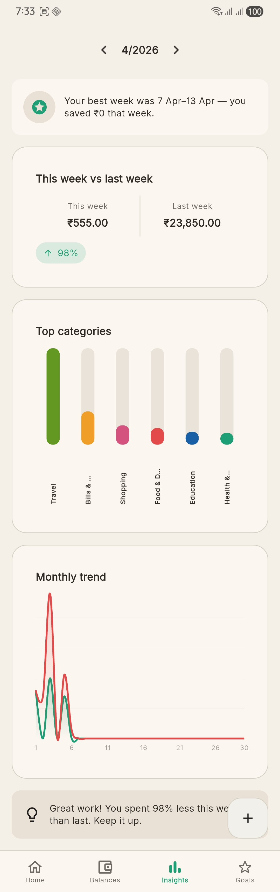
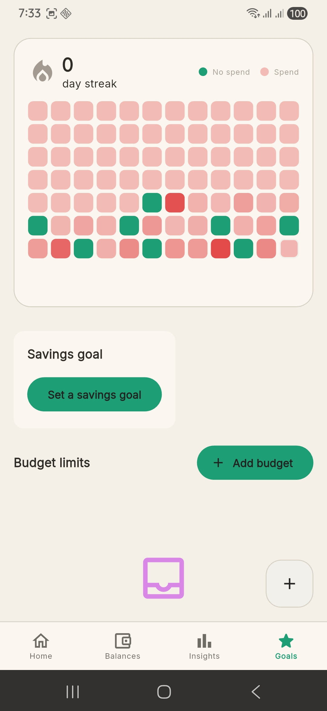
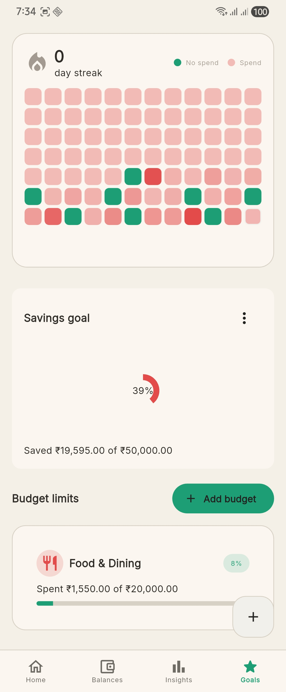

# FinTrack

FinTrack is a Flutter personal finance manager built with BLoC, Isar, and `go_router`. It helps users record income and expenses, understand spending patterns, track savings goals, and build no-spend streaks through a polished mobile-first UI.

This project follows the Finance Manager assignment brief and a dark fintech-inspired visual direction with animated cards, chart-driven insights, memorable empty states, and a goals-first savings experience.

## Highlights

- Flutter app architecture with `flutter_bloc`, `go_router`, `get_it`, and Isar local persistence
- Home dashboard with animated balance hero, weekly chart, donut breakdown, and recent transactions
- Transactions flow with filters, swipe actions, add/edit sheet, receipt scan entry points, and transaction detail sheets
- Insights tab with category analysis, weekly comparison, monthly trends, and personalized insight cards
- Goals tab with streak heatmap, savings goal progress, and category budget limits
- Custom categories support for more flexible transaction tracking
- Dark and light theme support

## Balance Card Gradient Logic

One of the signature interactions in the app is the home screen balance card. Its gradient changes according to the relationship between income and spending for the current month:

- `Good health`: teal gradient when expense-to-income ratio is below `0.70`
- `Warning`: amber gradient when expense-to-income ratio is between `0.70` and `0.90`
- `Danger`: red gradient when expense-to-income ratio is above `0.90`
- `No income yet`: defaults to the healthy teal gradient

This makes the balance card more than a static summary. It communicates monthly financial health at a glance using color and motion.

## Tech Stack

- Flutter
- Dart
- `flutter_bloc`
- Isar
- `get_it`
- `injectable`
- `go_router`
- `fl_chart`
- `intl`
- `google_fonts`
- `google_mlkit_text_recognition`
- `image_picker`

## Project Structure

```text
lib/
|-- core/
|   |-- constants/
|   |-- di/
|   |-- router/
|   |-- services/
|   |-- theme/
|   `-- utils/
|-- data/
|   |-- models/
|   `-- repositories/
|-- logic/
|   |-- goal_bloc/
|   |-- insights_cubit/
|   `-- transaction_bloc/
`-- ui/
    |-- screens/
    |   |-- goals/
    |   |-- home/
    |   |-- insights/
    |   `-- transactions/
    `-- shared/
```

## Core Screens

### Home

- Animated balance hero card
- Income and expense summary strip
- Spending breakdown donut chart
- Weekly spending chart
- Recent transactions preview
- Goal progress pill

### Transactions

- Full transaction history
- Filter chips and filter sheet
- Date-grouped list presentation
- Swipe to edit and delete
- Add and edit transaction sheet
- Receipt scan actions from camera and gallery
- Custom category creation

### Insights

- Category spending chart
- Weekly comparison card
- Monthly income vs expense line chart
- Best saving week insight
- Smart spending tips

### Goals

- Savings streak heatmap
- Savings goal progress ring
- Budget limit cards by category
- No-spend behavior tracking

## Feature List

### Dashboard and Daily Tracking

- Record income and expenses with amount, category, note, and date
- Add transactions manually or by scanning a receipt image
- View current balance with animated count-up behavior
- Surface recent transactions directly on the home screen
- Show monthly spending composition in a donut chart
- Show weekly spending trend in a bar chart

### Spending Intelligence

- Category-wise breakdown of expenses
- Weekly spending comparison
- Monthly income and expense trend visualization
- Personalized best-saving-week callout
- Smart tips based on transaction patterns

### Receipt Scanning and Faster Entry

- Launch receipt scanning from the add transaction sheet
- Capture receipt photos with the camera
- Pick receipt images from the gallery using `image_picker`
- Extract text with `google_mlkit_text_recognition`
- Pre-fill amount, merchant, date, and suggested category when available
- Review and edit extracted details before saving the transaction

### Goals and Habits

- Savings goal setup and progress tracking
- Budget limits per category
- No-spend streak visualization
- Heatmap view for habit consistency

### UX and Visual Polish

- Responsive dark and light themes
- Animated empty states
- Press, swipe, and count-up micro-interactions
- Floating app shell and bottom-sheet styling
- Gradient-led fintech visual language

### Data and Persistence

- Local-first storage with Isar
- Seed data on first launch
- Theme persistence
- App settings persistence
- Custom category persistence

## Setup

### Prerequisites

- Flutter SDK `3.x`
- Dart SDK `3.x`
- Android Studio or VS Code with Flutter tooling
- An Android emulator, iOS simulator, or physical device

### Install Dependencies

```bash
flutter pub get
```

### Generate Code

If you update Isar models or dependency injection configuration, run:

```bash
dart run build_runner build --delete-conflicting-outputs
```

### Run the App

```bash
flutter run
```

## Storage Notes

- The app uses Isar for local persistence
- Seed transactions are inserted on first launch
- App settings also store custom categories and first-launch metadata

## Routing and State Management

- Navigation is handled with `go_router`
- Transactions are managed with `TransactionBloc`
- Goals are managed with `GoalBloc`
- Insights are managed with `InsightsCubit`
- Theme mode is managed with `ThemeCubit`

## Screenshots

Current app screenshots from the project are shown below.

### Home Screen (Light)



### Home Screen (Dark)



### Transactions Screen



### Filter Sheet



### Add / Edit Transaction Sheet



### Insights Screen



### Goals Screen (Empty Goal State)



### Goals Screen (With Goal and Budget)



## Suggested Screenshot Checklist

- Home screen showing the balance hero card
- Transactions list with filters or swipe actions
- Add transaction sheet
- Receipt scan flow from camera or gallery
- Insights charts view
- Goals screen with streak heatmap and savings goal

## Design Notes

- Dark mode uses warm near-black surfaces instead of pure black
- Gradients are used for hierarchy and state instead of heavy shadows
- The balance hero card changes color based on monthly savings health
- Charts and empty states are part of the storytelling, not just placeholders

## Assignment Reference

The implementation aligns with the Finance Manager assignment brief and the linked design reference included in the PDF brief.

## Future Improvements

- Export and backup support
- Better onboarding and first-run walkthrough
- More insight cards and trend summaries
- Optional cloud sync
